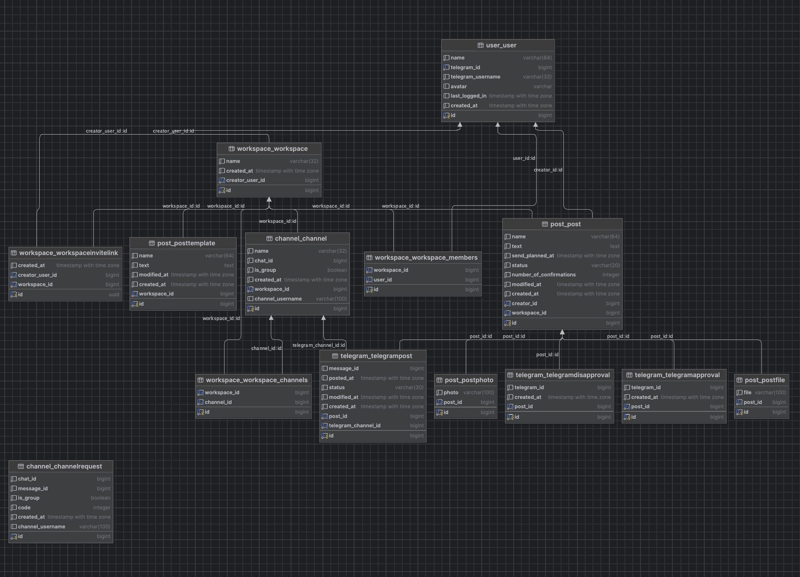

# PRODlenka team

## SMM Сервис

### Описание
Помощник СММ специалиста — это инновационная платформа, разработанная для облегчения работы с контентом в социальных сетях. Сервис предлагает широкий спектр инструментов для автоматизации создания, планирования и анализа постов, делая процесс управления социальными медиа более эффективным и менее времязатратным.

### Инструкция по установки
1. Склонируйте репозиторий:
``git clone https://github.com/Central-University-IT-prod/PROD-PRODlenka``
2. Перейдите в папку проекта:
``cd PROD-PRODlenka``
3. Запустите Docker Compose:
```docker-compose up```

### Полный список функций

#### Управление рабочим пространством
- Создание workspace
- Смена workspace
- Редактирование workspace
- Удалить workspace
- Покинуть workspace

#### Управление учетными записями
- Регистрация
- Авторизация
- Редактирование профиля
- Добавить пользователя в workspace
- Удалить пользователя из workspace

#### Управление контентом
- Создать пост
- Редактирование поста
- Просмотр поста
- Публикация поста в группу для проверки
- Публикация поста в каналах автоматически
- Отклонение поста
- Динамическое подтверждение поста

#### Планирование и аналитика
- Просмотр архива
- Просмотр статистики
- Просмотр календаря
- Поделиться календарем по ссылке

#### Дополнительные возможности
- Интеграция с нейросетью при создании поста


### Схема Базы данных

